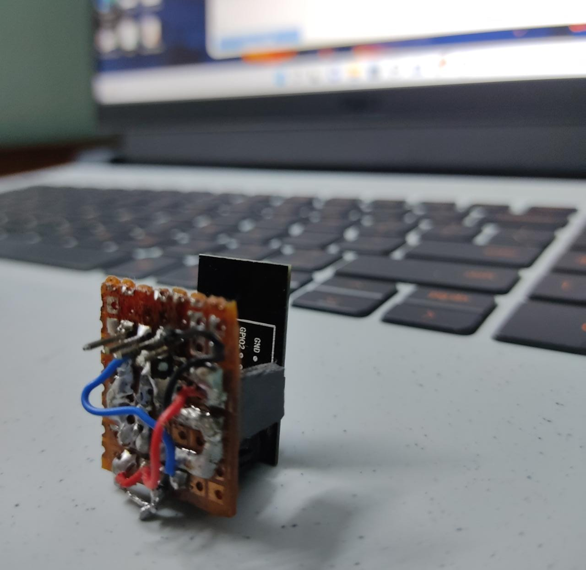

# esp8266_deauth

### Personal Project :

- Made a small wifi deauther using cheaply available esp8266.
- Recently devices uses a protection against this attack but many devices are still left to prevent this attack.
- Only to be used for educational purposes.

---

### Images :

#### Circuit Board :

#### Connections :

#### Soldering Station :

---

### Change Logs :

#### 0.0.1 
- Added the bin file
- Added some images
- Added the esp8266 flasher
- Made changes in readme.